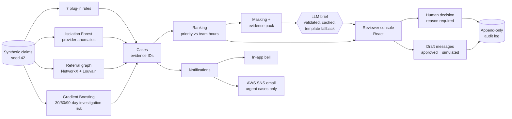

# ClaimShield Nexus

A review workbench for health-insurance fraud, waste and abuse teams. It finds suspicious claims, groups them into evidence-backed cases, ranks them against the team's hours, and hands each case to a person to decide. All data is synthetic.

## At a glance

| Question | Answer |
|---|---|
| What does it do? | Detects, explains, ranks and routes suspicious claims; investigators decide |
| Who uses it? | SIU admins, team leads and investigators |
| Who decides? | A person, always. Nothing is denied, blocked or sent automatically |
| What does every flag carry? | Evidence IDs, the type of check that found it, and a plain-language reason |
| How is AI used? | A masked, validated LLM writes briefs; a built-in template is the fallback |
| What is recorded? | Every login, assignment, decision, refusal and download, in an append-only audit log |

## How it works

## Quick start

Needs Python 3.11 and Node 20+.

| Step | Linux / macOS | Windows (PowerShell) |
|---|---|---|
| 1. Python environment | `python3.11 -m venv backend/.venv` | `python -m venv backend\.venv` |
| 2. Python packages | `backend/.venv/bin/python -m pip install -r backend/requirements.txt` | `backend\.venv\Scripts\python -m pip install -r backend\requirements.txt` |
| 3. Frontend packages | `npm --prefix frontend ci` | `npm --prefix frontend ci` |
| 4. Settings | `cp .env.example .env` | `copy .env.example .env` |
| 5. Data | `make data` | `.\make.ps1 data` |
| 6. API (terminal 1) | `make api` | `.\make.ps1 api` |
| 7. Web app (terminal 2) | `make web` | `.\make.ps1 web` |

Open http://localhost:5173 and sign in.

**Two settings are required** (set them in `.env`; both are blank in `.env.example`):

| Setting | Meaning |
|---|---|
| `JWT_SECRET` | Signs login tokens; 32+ random characters, e.g. `python -c "import secrets; print(secrets.token_hex(32))"` |
| `DEMO_PASSWORD` | Password of every demo user; 8+ characters |

**Demo users** (synthetic, created on first start):

| Username | Role | Unit |
|---|---|---|
| `admin` | Admin | none |
| `south_lead` | Team lead | Unit South |
| `south_inv1`, `south_inv2` | Investigator | Unit South |
| `north_lead` | Team lead | Unit North |
| `north_inv1`, `north_inv2` | Investigator | Unit North |

**Other commands**

| Command (`make` / `.\make.ps1`) | What it does |
|---|---|
| `test` | Backend tests and lint |
| `coverage` | Backend tests with a coverage report |
| `web-test` | Frontend lint and unit tests |
| `e2e` | Real-Chrome walkthrough of all three roles (API and web app must be running) |
| `reset` | Clean, demo-ready state (stop the API first); add `--email` to send the urgent-case emails; see [docs/DEMO.md](docs/DEMO.md) |

## Demo walkthrough (about 2 minutes)

| # | Sign in as | Do | What the judge sees |
|---|---|---|---|
| 1 | `admin` | Open **Overview** | Funnel: 5,000 claims, 58 findings, 20 cases, amount at risk, findings per rule |
| 2 | `admin` | Open **All Cases** | Ranked queue with a line where the team's 40 hours run out |
| 3 | `south_lead` | Open **CASE-0001** | Evidence E1, E2 (each names its check type), network graph, timeline, 30/60/90-day risk |
| 4 | `south_lead` | Read the brief | Every statement cites `[E#]`; badge shows who wrote it |
| 5 | `south_lead` | **Assign** to Arjun Nair with a reason | Case moves to *Assigned*; he is notified |
| 6 | `south_inv1` | Open **My Cases**, try a decision with no reason | Blocked; then record one with a reason |
| 7 | `south_inv1` | **Request records** | Editable draft; "will not be sent until you approve it" |
| 8 | `admin` | Open the audit log or download the case report | Each step with who, when and why |
| 9 | any | Click the bell | High-priority alerts first; envelope icon where an email was sent |

To show the engine is adaptable, follow "Show that the rule engine is adaptable" in [docs/DEMO.md](docs/DEMO.md).

## Roles and permissions

| Action | admin | team lead (own unit) | investigator |
|---|---|---|---|
| View a case | all | unit cases | assigned cases |
| Assign, reassign, unassign | no | yes | no |
| Decide, override priority, draft and approve messages | no | yes | assigned cases only |
| Download a case report (PDF) | yes | unit cases | assigned cases only |
| Download a unit report (PDF/CSV), see workload | yes | own unit | no |
| Rerun, prewarm briefs, test email, manage users and units | yes | no | no |

Cases are routed to the unit covering the main provider's city: Unit South (Chennai, Bengaluru, Hyderabad) or Unit North (Delhi, Mumbai, Kolkata). A case no unit covers is "unrouted" and only the admin sees it. Every refusal returns 403 and is audited.

## Detection approaches

| Approach | Type | What it catches |
|---|---|---|
| Duplicate billing | Claim rule | Same member, provider, code and date billed twice |
| Unbundling | Claim rule | A panel's components billed separately for more than the panel costs |
| Upcoding | Claim rule | Top consultation level billed far more than peers (guarded for honest busy specialists) |
| Billing during a hospital stay | Claim rule | Services billed while the member was an inpatient elsewhere |
| Excess utilization | Claim rule | Implausibly many sessions per member per month |
| Impossible timing | Claim rule | A member at two far-apart facilities in one day, or a provider billing over 24 hours in a day |
| Repeat investigation history | Claim rule | A provider with a confirmed past case whose volume is rising again |
| Provider profile anomaly | Anomaly model (Isolation Forest) | Providers whose overall profile is unusual against same-specialty peers |
| Referral ring | Network analysis (NetworkX + Louvain) | Communities with heavy shared patients and self-referral between related owners |
| Investigation risk | Gradient Boosting, 30/60/90 days | How likely a confirmed investigation is; shown beside the evidence, never instead of it |

New rules are plug-ins: drop a file into `backend/detect/rules/` and it runs with no engine change; a rule that crashes is skipped and logged.

## Results (synthetic data)

**Planted scenarios.** Every scenario is found and both honest decoys are left alone. Produced by `python -m backend.tests.scenario_report`.

| Planted scenario | Planted | Flagged | Caught by | Case |
|---|---|---|---|---|
| Duplicate billing | 20 | 20 | duplicate | CASE-0002, 0004, 0006 … |
| Unbundled panels | 50 | 50 | unbundling | CASE-0011, 0012 |
| Phantom services (member in hospital) | 11 | 11 | phantom | CASE-0004 |
| Over-utilising members | 3 | 3 | utilization | CASE-0003, 0008 |
| Upcoding provider | 1 | 1 | upcoding | CASE-0003 |
| Repeat offender (rising volume) | 1 | 1 | repeat_history; 30-day band High | CASE-0005 |
| Impossible timing (30 hours in a day) | 1 | 1 | impossible_timing | CASE-0014 |
| Referral ring (self-referring owners) | 5 | 5 | ring, anomaly | CASE-0001 |
| Honest busy specialist (must not be flagged) | 1 | 0 | none (correct) | none |
| Honest same-day follow-ups (must not be flagged) | 40 | 0 | none (correct) | none |

**Investigation-risk models.** One model per window, each tested alone on its last held-out cut-off (`metrics.json`).

| Window | Train rows / positives | Test rows / positives | Precision at 5 | Precision at 10 | Recall at 0.3 | PR-AUC (base rate) |
|---|---|---|---|---|---|---|
| 30 days | 120 / 12 | 40 / 3 | 0.0 | 0.1 | 0.0 | 0.145 (0.075) |
| 60 days | 120 / 18 | 40 / 8 | 0.6 | 0.6 | 0.375 | 0.642 (0.200) |
| 90 days | 80 / 15 | 40 / 10 | 0.6 | 0.6 | 0.6 | 0.627 (0.250) |

These check that the pipeline works, not real-world accuracy: 40 providers and six months give each window only a handful of positives. Longer windows look better because more investigations fall inside them. A transparent history rule raises a repeat offender to High in every window and says so (`band_source: escalated`). Case ranking uses the 30-day estimate.

| Quality | Value |
|---|---|
| Backend tests | 527 passing, no network access, 97% coverage of `backend/` |
| Frontend tests | 133 passing, plus a real-Chrome walkthrough (60 checks) |
| CI | Lint, tests and build on every push |

## Responsible AI

| Principle | How it is enforced |
|---|---|
| Human in the loop | Every decision, override and assignment needs a signed-in person and a written reason; no endpoint denies a claim or blocks a payment |
| Investigation risk, not fraud probability | Models predict a confirmed *investigation*; the words "fraud probability" never appear (a test scans for it); wording is "suspicious" or "warrants review" |
| Evidence for everything | Findings carry claim IDs; briefs cite `[E#]`; each item names its check type, e.g. "Duplicate billing (claim rule)" |
| Masking before any LLM call | Only an allow-listed, masked copy leaves the server (`PERSON_1`, `ORG_2`); a leak check blocks the call; real values return only after validation |
| Validated, with a safe fallback | A brief with an unknown citation, missing section, missing check type or accusatory wording is rejected, retried once, then replaced by the template |
| Minimal-content email | Urgent cases only, one per case per 24 h, with just the case ID, rank, detector count and link |
| No unapproved outbound messages | Drafts only; approval marks them "sent (simulated)" |
| Append-only audit | The database refuses edits and deletes; refusals and downloads are logged |
| Role-based access in the API | Permissions are enforced server-side; screens only reflect them |

## Configuration

Copy `.env.example` to `.env` (git-ignored). Every setting is listed there, empty, with a one-line comment.

| Setting | Needed for |
|---|---|
| `JWT_SECRET`, `DEMO_PASSWORD` | Running the app (required) |
| `LLM_PROVIDER` (`groq`, `xai`, `anthropic`; default `none`), `LLM_API_KEY`, `LLM_MODEL` | AI-written briefs; without them the template writes every brief |
| `NOTIFY_EMAIL_ENABLED`, `SNS_TOPIC_ARN`, `AWS_REGION`, `APP_BASE_URL`, `AWS_ACCESS_KEY_ID`, `AWS_SECRET_ACCESS_KEY` | Urgent-case email through AWS SNS (key needs only `sns:Publish` on the topic) |
| `CLAIMSHIELD_AUDIT_PATH`, `VITE_API_URL` | Optional: another audit file; another API address for the web app |

## Known limitations

| Limitation | Detail |
|---|---|
| Synthetic data only | Results show the pipeline works, not performance on real claims |
| Small history | About 40 providers and 300 members, so the models have few positives; the 90-day model has only two cut-offs to learn and test on |
| Demo-grade sign-in | bcrypt passwords, signed tokens and server-side roles, but no password reset, token revocation or multi-factor sign-in |
| LLM output varies | A reply that breaks the rules falls back to the template; only Groq was tested live, Claude and Grok through mocks |
| Outbound messages simulated | Nothing is sent to a provider or member |
| Email needs AWS | Without your own SNS topic and credentials, everything else still works |
| Rules need a developer | A rule is a Python file; thresholds live in it |

## Tech stack

| Layer | Used |
|---|---|
| Backend | Python 3.11, FastAPI, Pydantic, SQLite, pandas, scikit-learn, NetworkX, python-louvain, bcrypt, PyJWT, reportlab, boto3, anthropic and openai SDKs |
| Frontend | React 19, Vite, Tailwind CSS, Recharts, react-force-graph-2d, React Router, axios; light and dark themes |
| Quality | pytest and pytest-cov, ruff, Vitest and React Testing Library, oxlint, Playwright-driven Chrome, GitHub Actions |

## Project structure

| Path | Contents |
|---|---|
| `backend/data/` | Synthetic data generator (seed 42) and reference data |
| `backend/detect/` | Rule engine and plug-in rules (`rules/`), anomaly model, referral graph |
| `backend/features/`, `backend/predict/` | Provider features; 30/60/90-day risk models |
| `backend/cases/` | Case building, ranking, capacity scheduling |
| `backend/brief/` | Evidence packs, template, validator, masking, LLM calls, check-type labels |
| `backend/notify/` | In-app notifications, SNS email, outbound drafts |
| `backend/access/` | Users, units, permissions, routing, tokens |
| `backend/api/`, `backend/reports/` | FastAPI app and views; PDF and CSV reports |
| `backend/tests/` | Test suite and `scenario_report.py` |
| `backend/demo_reset.py` | `make reset` |
| `frontend/` | React app, unit tests, `e2e/flow.mjs` |
| `docs/` | `DEMO.md` (checklist, offline fallback, rule demo), `TESTING.md` (what each test proves), `demo/weekend_billing.py` (demo rule) |
