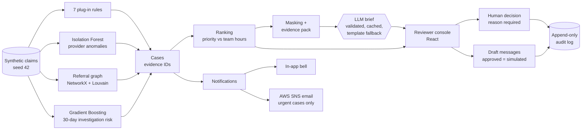

# ClaimShield Nexus

[](https://github.com/HARISH241501066/Claim-X/actions/workflows/ci.yml)

ClaimShield Nexus helps a health insurer's special investigations unit (SIU) find and review claims that warrant a second look. It scans a synthetic claims history with seven plug-in rules, an anomaly model, a referral-network analysis and a small risk model, groups what it finds into cases, ranks them against the team's available hours, and writes an evidence-cited brief for each case. Investigators work in a role-based console: a team lead assigns cases, the assigned investigator reviews the evidence and decides, and every step is written to an append-only audit log. **The system only recommends. A person decides every case, and nothing is ever denied, blocked or sent automatically.** All data is synthetic.

## How it works



Everything above the console runs in one pipeline (about 4 seconds) every time the API starts or an admin reruns it.

## Quick start

You need Python 3.11 and Node 20+ (tested with Node 24). From a fresh clone:

```bash
# 1. Backend: virtual environment and dependencies
python3.11 -m venv backend/.venv
backend/.venv/bin/python -m pip install -r backend/requirements.txt        # Linux / macOS
#   Windows (PowerShell):  backend\.venv\Scripts\python -m pip install -r backend\requirements.txt

# 2. Frontend dependencies
npm --prefix frontend ci

# 3. Settings: copy the template, then set JWT_SECRET and DEMO_PASSWORD in .env (see below)
cp .env.example .env
python -c "import secrets; print(secrets.token_hex(32))"     # paste this as JWT_SECRET

# 4. Run
make data      # generate the synthetic database and the (test-only) ground truth
make api       # API on http://localhost:8000  (docs at /docs)  - leave it running
make web       # web app on http://localhost:5173              - in a second terminal
make test      # backend tests and lint
```

On Windows without `make`, use the same names with the shim: `.\make.ps1 data`, `.\make.ps1 api`, `.\make.ps1 web`, `.\make.ps1 test`, `.\make.ps1 web-test`.

Open http://localhost:5173 and sign in. Only two values in `.env` are required to run; everything else is optional (and blank by default):

| Setting | Why |
|---|---|
| `JWT_SECRET` | Signs the 8-hour login tokens (32+ random characters). |
| `DEMO_PASSWORD` | The password of every seeded demo user (8+ characters). |

On an empty database the API creates these synthetic users: `admin`, and for each unit a lead and two investigators: `south_lead`, `south_inv1`, `south_inv2`, `north_lead`, `north_inv1`, `north_inv2`.

Other commands: `make coverage` (tests with a coverage report), `make web-test` (frontend lint and unit tests), `make e2e` (a real-Chrome walkthrough; needs the API and web app running), and **`make reset`** (a clean, demo-ready state, see [docs/DEMO.md](docs/DEMO.md)).

## Demo walkthrough (about 2 minutes)

1. **Overview (sign in as `admin`).** The funnel shows 5,000 claims analysed, 58 findings grouped into 20 cases, and the rupee amount at risk, with a chart of findings per rule.
2. **Queue.** "All Cases" ranks the cases by priority and draws a line where the team's 40 hours run out. Change the capacity or the priority weights and the order updates.
3. **Ring case.** Open CASE-0001, a referral ring. Evidence items E1, E2 … each cite the claims behind them. The network graph shows owners, facilities and providers linked by referrals, with the suspicious links marked. The timeline and the 30-day investigation risk (with its band and why) sit beside it.
4. **Brief.** The brief is built only from that evidence; every statement cites an `[E#]` that opens its claim rows. The badge says who wrote it ("Template", or "Groq (cached)" when an LLM is configured).
5. **Assign.** Sign out, sign in as `south_lead`, open the Unit Queue and assign CASE-0001 to Arjun Nair with a reason. Team Workload shows his hours against capacity.
6. **Decide.** Sign in as `south_inv1`. The bell shows "Case CASE-0001 assigned to you"; My Cases lists it. Try a decision without a reason (blocked), then record one with a reason. Draft a records request: it cannot be sent until approved, and then it is only marked "Sent (simulated)".
7. **Audit and downloads.** Download the case report (PDF). As `admin`, the audit log shows the login, the assignment, the decision and the download, each with who and when. High-priority cases also appear at the top of the bell, with an envelope when an email was sent.

## Detection approaches

| Approach | What it catches |
|---|---|
| Rule: duplicate | The same member, provider, code and date billed twice. |
| Rule: unbundling | A panel's components billed separately for more than the panel costs. |
| Rule: upcoding | A provider billing the top consultation level far more than peers (guarded against honest busy specialists). |
| Rule: phantom | Services billed while the member was an inpatient elsewhere. |
| Rule: utilization | Members receiving implausibly many sessions in a month. |
| Rule: impossible timing | A member at two far-apart facilities on one day, or a provider billing more than 24 hours in a day. |
| Rule: repeat history | A provider with a confirmed past case whose volume is rising again. |
| Isolation Forest | Providers whose overall profile is unusual against peers of the same specialty. |
| Graph analytics (NetworkX, Louvain) | Referral rings: communities of providers and facilities with heavy shared patients and self-referral between related owners. |
| Gradient Boosting | A 30-day **investigation risk** per provider (how likely a confirmed investigation is), shown beside the evidence, never instead of it. |

New rules are plug-ins: drop a file into `backend/detect/rules/` and it runs with no engine change.

## Results (synthetic data)

Every planted scenario is found, and the two honest decoys are not flagged. Produced by `python -m backend.tests.scenario_report`, which checks the generator's ground truth (used only in tests and this report) against the findings:

| Planted scenario | Planted | Flagged | Caught by | Case |
|---|---|---|---|---|
| Duplicate billing | 20 | 20 | duplicate (20) | CASE-0002, CASE-0004, CASE-0006 … |
| Honest same-day follow-ups (should NOT be flagged) | 40 | 0 | none (correct: yes) | none |
| Honest busy specialist (should NOT be flagged) | 1 | 0 | none (correct: yes) | none |
| Impossible timing (30 hours in a day) | 1 | 1 | duplicate (1), impossible_timing (1); 30-day band Low | CASE-0014 |
| Over-utilising members | 3 | 3 | utilization (3) | CASE-0003, CASE-0008 |
| Phantom services (member in hospital) | 11 | 11 | duplicate (1), phantom (11); 30-day band Low | CASE-0004 |
| Repeat offender (rising volume) | 1 | 1 | repeat_history (1); 30-day band High | CASE-0005 |
| Referral ring (self-referring owners) | 5 | 5 | anomaly (1), ring (5) | CASE-0001 |
| Unbundled panels | 50 | 50 | duplicate (1), unbundling (50), utilization (4); 30-day band High/Low | CASE-0011, CASE-0012 |
| Upcoding provider | 1 | 1 | upcoding (1); 30-day band Low | CASE-0003 |

"Caught by" lists every detector that flagged at least one planted entity, so a second detector may appear for a few overlapping claims. Cases are grouped by provider, so several scenarios can share a case.

The risk model is evaluated alone, on the held-out last cut-off (`metrics.json`):

| Metric | Value |
|---|---|
| Training rows / positives | 120 / 12 |
| Test rows / positives | 40 / 3 |
| Precision at 5 | 0.0 |
| Precision at 10 | 0.1 |
| Recall at threshold 0.3 | 0.0 |
| PR-AUC (base rate 0.075) | 0.145 |

These are low, and reported as they are: there are only 40 providers and 3 positives in the test window, so the numbers check that the pipeline works, not real-world accuracy. That is why a transparent history rule backs the model (a repeat offender is raised to High and the band says so: `band_source: escalated`).

Backend tests: 498 passing (run with no network access), coverage 97% of `backend/`. Frontend: unit tests plus a real-Chrome end-to-end run.

## Responsible AI

- **Human in the loop.** Every decision needs a signed-in person and a written reason. No endpoint denies a claim or blocks a payment. Messages to providers and members are drafts only; approving one marks it "sent (simulated)".
- **Investigation risk, not fraud probability.** The model outputs how likely a confirmed *investigation* is. The words "fraud probability" never appear in the code or screens (a test scans for it), and the wording says "suspicious" or "warrants review", never that anyone is guilty.
- **Evidence for everything.** Each finding carries evidence IDs (claim IDs); each statement in a brief cites an evidence key; the screens link every key to its claim rows.
- **Masking before any LLM call.** Only an allow-listed, masked copy of the evidence leaves the server (names and IDs become placeholders such as `PERSON_1`); a leak check blocks the call if anything slips through, and the real values are restored only after the reply is validated.
- **Validated, with a safe fallback.** A reply with an unknown citation, a missing section, changed confidence text or accusatory wording is rejected, retried once with the validator's message, and then replaced by the built-in template. A 429 or timeout is retried once; accepted briefs are cached, so a demo does not depend on the LLM being up.
- **Minimal-content emails.** Only urgent cases email the SIU team, one per case per 24 hours, containing just the case ID, rank, detector count and a link. A validator blocks any body with names, member or claim IDs, amounts, scores or accusatory words.
- **Append-only audit.** Decisions, overrides, assignments, logins, refused attempts, downloads, drafts and email attempts are written to a log the database itself refuses to edit or delete.
- **Role-based access in the API.** Admin, team lead and investigator permissions are enforced by the API (the screens only reflect them), and every refusal is audited.

## Known limitations

- **Synthetic data only.** The scenarios are planted by a generator, so results show the pipeline works, not how it would perform on real claims.
- **Small history.** About 40 providers and 300 members, so the risk model has few positives; the history rule backs it up and the metrics are modest.
- **30-day horizon only.** 60- and 90-day risk models are not trained; the screen shows them as unavailable.
- **Demo-grade sign-in.** Real bcrypt passwords, signed tokens and API-enforced roles, but no password reset, no token revocation list and no multi-factor sign-in.
- **LLM output varies.** A reply that breaks the rules falls back to the template, and a provider's rate limit can delay a brief. Only Groq was tested live; Claude and Grok are covered by mocks and SDK-level tests.
- **Outbound messages are simulated.** Nothing is ever sent to a provider or member.
- **Email needs AWS.** Urgent-case emails need your own SNS topic and credentials; without them everything else still works.

## Configuration

Copy `.env.example` to `.env` (git-ignored). Every variable is listed there with a one-line comment and an empty value.

- **LLM briefs (optional).** Set `LLM_PROVIDER` to `groq`, `xai` or `anthropic` and `LLM_API_KEY`. With the default (`none`) the built-in template writes the briefs. `POST /admin/prewarm-briefs?top=5` (admin) writes and stores the top briefs ahead of time.
- **Urgent-case email (optional).** Set `NOTIFY_EMAIL_ENABLED=true`, `SNS_TOPIC_ARN`, `AWS_REGION`, `APP_BASE_URL` and AWS credentials with `sns:Publish` on that topic. An admin can check the channel from System → Send test email.

| Action | admin | team lead (own unit) | investigator |
|---|---|---|---|
| View a case | all | unit cases | assigned cases |
| Assign, reassign, unassign | no | yes | no |
| Decide, override priority, draft and approve messages | no | yes | assigned cases only |
| Download a case report (PDF) | yes | unit cases | assigned cases only |
| Download a unit report (PDF/CSV), see workload | yes | own unit | no |
| Rerun, prewarm, test email, manage users and units | yes | no | no |

Cases are routed after each run to the unit covering the main provider's city (Unit South: Chennai, Bengaluru, Hyderabad; Unit North: Delhi, Mumbai, Kolkata). A case no unit covers is "unrouted" and only the admin sees it. Reports carry a confidentiality footer on every page.

## Tech stack

| Layer | Used |
|---|---|
| Backend | Python 3.11, FastAPI, Pydantic, SQLite, pandas, scikit-learn (Isolation Forest, Gradient Boosting), NetworkX and python-louvain, bcrypt and PyJWT, reportlab, boto3 (SNS), anthropic and openai SDKs |
| Frontend | React 19, Vite, Tailwind CSS, Recharts, react-force-graph-2d, React Router, axios |
| Tests and quality | pytest (+ pytest-cov), ruff, Vitest and React Testing Library, oxlint, a Playwright-driven Chrome walkthrough, GitHub Actions |

```
backend/
  data/        synthetic data generator (seed 42) and reference data
  detect/      rules (plug-ins in rules/), anomaly model, referral graph
  features/    provider features
  predict/     30-day investigation risk model
  cases/       case building, ranking and capacity scheduling
  brief/       evidence packs, template, validator, masking, LLM integration
  notify/      in-app notifications, SNS email, outbound drafts
  access/      users, units, permissions, routing, tokens
  api/         FastAPI app, dependencies, scoped views
  reports/     case and unit PDF/CSV reports
  demo_reset.py   make reset
  tests/       pytest suite (no network, outside services mocked) and scenario_report.py
frontend/      React app, unit tests and e2e/flow.mjs
docs/          DEMO.md (demo checklist) and TESTING.md (what each test proves)
```
